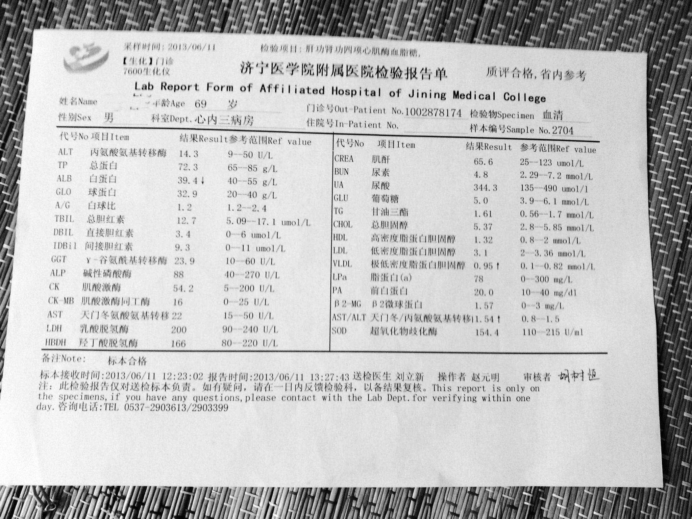

# compare OCR on Simplified Chinese between providers

- tesseract-ocr: https://github.com/tesseract-ocr
- baidu: https://ai.baidu.com/tech/ocr
- alibaba: https://duguang.aliyun.com/experience?type=doc&midtype=fulldoc&subtype=general
- tencent: https://cloud.tencent.com/act/event/ocrdemo

baidu, alibaba and tencent are the top 3 IT in china

## test image

## results

The best for now is tencent I think

go [./results](./results) for details